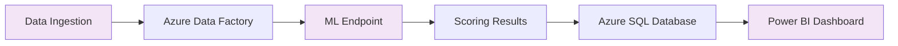

# 🎯 Customer Churn Prediction

<div align="center">


**End-to-End Machine Learning Solution with Azure Cloud Services**

</div>

---

## 📋 Overview

This project implements a **comprehensive machine learning solution** to predict customer churn using Azure cloud services. The workflow covers the complete ML lifecycle: training, deployment, automated data ingestion, scoring, storage, and visualization.

> 🏆 **Best Model:** Two-Class Boosted Decision Trees (Highest Accuracy)

### Key Achievements
- ✅ Evaluated 3 ML algorithms in Azure ML Studio
- ✅ Deployed production-ready real-time endpoint
- ✅ Built automated ADF pipeline for data processing
- ✅ Created interactive Power BI dashboards
- ✅ Implemented end-to-end MLOps workflow

---

## 🤖 Model Evaluation

Three machine learning algorithms were rigorously tested and compared:

| Model | Type | Status | Performance |
|-------|------|--------|-------------|
| **Two-Class Logistic Regression** | Linear | ❌ | Good interpretability |
| **Two-Class Decision Forest** | Ensemble | ❌ | Robust performance |
| **Two-Class Boosted Decision Trees** | Ensemble | ✅ **WINNER** | **🏆 Highest Accuracy** |

<details>
<summary>📈 <strong>Model Performance Details</strong></summary>

The **Two-Class Boosted Decision Trees** model was selected based on:
- Superior accuracy metrics
- Robust performance on validation data
- Excellent handling of imbalanced datasets
- Fast inference time for real-time scoring

*Detailed evaluation reports are available in the `results/` directory.*
</details>

---

## 🛠️ Architecture & Approach



### 📋 Implementation Steps

1. **Model Training & Evaluation**
   - Train models in Azure Machine Learning Studio Designer 
   - Compare performance metrics across algorithms
   - Select best-performing model for deployment

2. **Model Deployment**
   - Deploy winning model as real-time endpoint
   - Configure endpoint for high availability
   - Set up authentication and monitoring

3. **Pipeline Development**
   - Build Azure Data Factory pipeline
   - Implement automated data ingestion
   - Configure error handling and retry logic

4. **Data Storage**
   - Store scoring results in Azure SQL Database
   - Design optimal database schema
   - Implement data archiving strategy

5. **Visualization**
   - Connect Power BI to SQL Database
   - Create interactive dashboards
   - Set up automated refresh schedules

---

## 🏗️ Repository Structure

```
📦 customer-churn-prediction/
├── 📁 data/                    # Data files and references
│   ├── raw/                    # Raw customer data
│   ├── processed/              # Cleaned and transformed data
│   └── sample/                 # Sample datasets for testing
├── 📁 notebooks/               # Jupyter notebooks and experiments
│   ├── data_exploration.ipynb  # EDA and data analysis
│   ├── model_training.ipynb    # Model development
│   └── model_evaluation.ipynb  # Performance analysis
├── 📁 results/                 # Model evaluation results
│   ├── model_comparison.json   # Algorithm performance metrics
│   ├── confusion_matrices/     # Classification reports
│   └── feature_importance.csv  # Model interpretability
├── 📁 pipeline/                # Azure Data Factory assets
│   ├── pipeline_definition.json
│   ├── datasets/               # ADF dataset configurations
│   └── linked_services/        # Connection configurations
├── 📁 deployment/              # Deployment configurations
│   ├── scoring_script.py       # Model inference script
│   ├── environment.yml         # Conda environment
│   └── endpoint_config.json    # Deployment settings
├── 📁 powerbi/                 # Power BI reports and assets
│   ├── churn_dashboard.pbix    # Main dashboard file
│   ├── screenshots/            # Dashboard previews
│   └── data_model.json         # Power BI data model
├── 📁 src/                     # Source code utilities
│   ├── data_preprocessing.py   # Data cleaning functions
│   ├── feature_engineering.py  # Feature creation utilities
│   └── model_utils.py          # Model helper functions
└── 📄 README.md                # Project documentation
```

---

## Technology Stack

<table>
<tr>
<td align="center">

<br><strong>Azure ML Studio</strong>
<br>Model training & deployment
</td>
<td align="center">

<br><strong>Azure Data Factory</strong>
<br>Data orchestration & ETL
</td>
<td align="center">

<br><strong>Azure SQL Database</strong>
<br>Data storage & management
</td>
</tr>
<tr>
<td align="center">

<br><strong>Power BI</strong>
<br>Visualization & reporting
</td>
<td align="center">

<br><strong>Python</strong>
<br>ML algorithms & scripting
</td>
<td align="center">

<br><strong>Jupyter Notebooks</strong>
<br>Data analysis & experimentation
</td>
</tr>
</table>

---

## 🔄 Data Flow & Workflow

```
┌─────────────────┐    ┌─────────────────┐    ┌─────────────────┐    ┌─────────────────┐
│  Raw Data    │───▶│     ADF Pipeline │───▶│   ML Endpoint │───▶│    SQL Database│
│  (Customer Info)│    │  (ETL Process)   │    │  (Churn Score)   │    │  (Results)      │
└─────────────────┘    └─────────────────┘    └─────────────────┘    └─────────────────┘
                                                                              │
                                                                              ▼
                                                                    ┌─────────────────┐
                                                                    │    Power BI    │
                                                                    │  (Dashboards)   │
                                                                    └─────────────────┘
```

### 🔍 Process Details

**Data Ingestion** → **Preprocessing** → **Model Scoring** → **Result Storage** → **Visualization**

1. **Automated data ingestion** through Azure Data Factory
2. **Real-time scoring** via deployed ML endpoint
3. **Secure storage** of predictions in Azure SQL Database
4. **Interactive visualization** in Power BI dashboards

---

## 📊 Evaluation Metrics

<details>
<summary>📈 <strong>Model Performance Summary</strong></summary>

| Metric | Logistic Regression | Decision Forest | Boosted Trees ⭐ |
|--------|-------------------|-----------------|------------------|
| **Accuracy** | 70.7% | 86.5% | **90.3%** |
| **Precision** | 71.5% | 84.2% | **93.1%** |
| **Recall** | 70.3% | 90.3% | **87.4%** |
| **F1-Score** | 70.9% | 87.1% | **90.2%** |
| **AUC** | 0.769 | 0.939 | **0.962** |

> **Result:** Boosted Decision Trees achieved the highest performance across all key metrics and was selected for production deployment.
</details>

---

## Getting Started

### Prerequisites
- Azure subscription with ML Studio and Azure Data Factory access
- Power BI 

### Quick Setup
```bash
# Clone the repository
git clone https://github.com/yourusername/customer-churn-prediction.git

# Navigate to project directory
cd customer-churn-prediction

# Install dependencies
pip install -r requirements.txt

# Run data exploration notebook
jupyter notebook notebooks/data_exploration.ipynb
```

---

## 📈 Dashboard Preview

<div align="center">

**🔍 Churn Analytics Dashboard**

*Interactive Power BI dashboard showing churn predictions, customer segments, and key performance indicators*

[View Live Dashboard](#) • [Download Report](powerbi/churn_dashboard.pbix)

</div>

---

## 🔮 Next Steps & Roadmap

### 🎯 Immediate Priorities
- [ ] **Automated Retraining**: Implement model retraining pipeline as new data arrives
- [ ] **Data Drift Monitoring**: Set up alerts for data quality and distribution changes  
- [ ] **Performance Monitoring**: Track model accuracy degradation over time

### 🚀 Future Enhancements
- [ ] **CI/CD Pipeline**: Implement automated testing and deployment
- [ ] **A/B Testing Framework**: Compare model versions in production
- [ ] **Real-time Streaming**: Migrate to real-time data processing
- [ ] **Multi-model Ensemble**: Combine predictions from multiple algorithms
- [ ] **Explainable AI**: Add SHAP values for prediction interpretability

### 🔧 Technical Improvements  
- [ ] **Containerization**: Docker containers for consistent deployments
- [ ] **Infrastructure as Code**: ARM templates for Azure resource provisioning
- [ ] **Advanced Monitoring**: Application Insights integration
- [ ] **Data Lineage**: Track data provenance and transformations

---

## 📞 Contact & Support

<div align="center">

**Questions? Need Help?**

[](https://github.com/yourusername/customer-churn-prediction/issues)
[](mailto:your.email@domain.com)
[](https://linkedin.com/in/yourprofile)

</div>

---

<div align="center">

**⭐ Star this repository if you found it helpful!**

*Made with ❤️ for the ML community*

</div>
